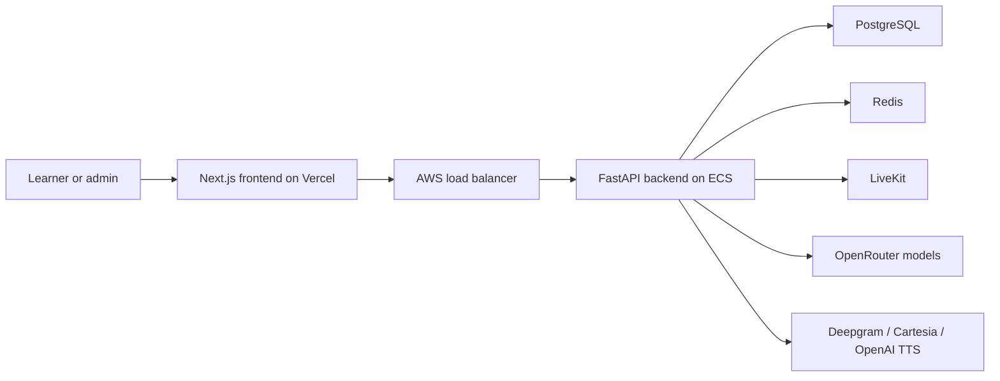
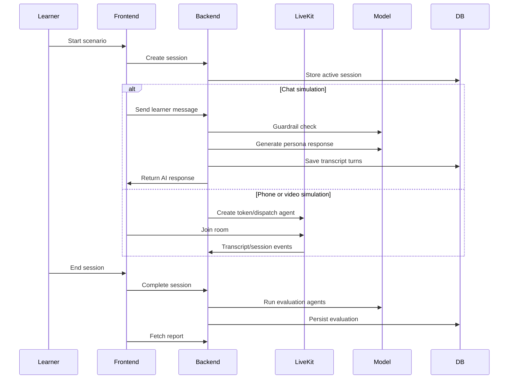

# Squinia Backend Architecture

This document explains the backend architecture for Squinia and how it supports the production platform.

## Production Context

Squinia is deployed as:

- Frontend: Vercel at https://squinia-frontend.vercel.app/
- Backend: AWS ECS service behind an application load balancer
- Realtime calls: LiveKit
- Primary database: PostgreSQL
- Cache/session support: Redis
- AI providers: OpenRouter/OpenAI-compatible models, OpenAI, Groq, Deepgram, and Cartesia

## High-Level Architecture

## Backend Layers

The backend is organized into clear layers:

- API routes receive requests, validate input, and return schemas.
- Services own business workflows such as session start/end, evaluation, auth, and scenario management.
- Repositories encapsulate database access.
- Models define persistent domain objects.
- Schemas define request and response contracts.
- AI services isolate model calls, prompts, guardrails, and evaluation orchestration.

This structure keeps product logic separate from transport, persistence, and model-provider details.

## Core Domain Model

The main entities are:

- Organisation: tenant boundary for teams and bootcamps.
- User: admin, instructor, or learner.
- Cohort: group of learners.
- Assignment: scenario assigned to one or more learners.
- Scenario: real-world role-play context and instructions.
- Persona: reusable AI character with name, title, gender, avatar, voice behavior, and traits.
- Rubric: evaluation criteria and scoring weights.
- Session: one learner's simulation attempt.
- Transcript: normalized conversation turns.
- Evaluation: final assessment with score, rationale, examples, and improvement guidance.

## Simulation Flow

## Prompt And Model Strategy

Squinia uses different model interactions for different responsibilities:

- Simulation prompt: role-play as the selected persona, follow the organisation scenario, start the conversation naturally, stay in character, and close realistically.
- Guardrail prompt: detect jailbreaks, prompt injection, and unsafe attempts in chat simulation input.
- Evaluation prompt: score against rubric criteria, cite exact learner transcript quotes, and provide concrete improvement wording.
- Evaluation review step: check whether the generated evaluation is specific, grounded, and useful.

Provider fallback is used where appropriate so the product is less brittle when one provider is slow or unavailable.

## Persona-Aware Voice Selection

Personas carry gender and voice metadata. The LiveKit voice agent maps that metadata into provider-specific voices:

- Female personas use female-preferred voices.
- Male personas use male-preferred voices.
- If a preferred provider is unavailable, fallback providers are used.

The goal is not only technical correctness but learner immersion.

## Data And Persistence

PostgreSQL is the source of truth for product and simulation data. The backend persists:

- Persona and scenario configuration.
- Session lifecycle.
- Transcript turns.
- Evaluation summaries and rubric-level scores.
- Example quotes and improvement guidance.

Alembic migrations manage schema changes.

## Resilience And Error Handling

The backend uses:

- Structured logging for key events and failures.
- Application-specific exceptions for expected domain errors.
- Provider fallback for selected AI and voice operations.
- Health checks for deployment readiness.
- Load-balanced ECS deployment for production availability.

Known local-development concern: uvicorn reload can start duplicate LiveKit workers. Use `LIVEKIT_WORKER_PORT=0` and stop stale local workers before testing voice/video flows.

## Security Boundaries

Important boundaries:

- Tenant-aware access control for organisation data.
- JWT/session validation on protected routes.
- Secrets kept outside source control.
- Chat guardrail screening before model response generation.
- CORS and cookie settings configured per environment.

## Testing Strategy

Existing focused tests cover:

- Auth service behavior.
- Transcript ingestion and normalization.
- Persona prompt construction.
- LiveKit voice selection.
- Chat guardrail behavior.
- Evaluation/report data paths.

Recommended next step: add end-to-end tests that create a persona, create a scenario, run a mock simulation, persist transcript data, and verify the rendered evaluation contract.

## Deployment Shape

The backend deploys as a Dockerized FastAPI app on AWS ECS behind an application load balancer. The load balancer should route health checks to `/health`. Database migrations should run before release or as an explicit deployment step.

Useful files:

- `Dockerfile`
- `DEPLOYMENT_AWS.md`
- `infra/terraform/`
- `.github/workflows/deploy-backend.yml`

## Review Talking Points

The strongest engineering story is that Squinia is not a single model call. It is a multi-step AI product with tenant-aware scenario configuration, reusable personas, real-time simulation surfaces, transcript persistence, guardrails, and grounded evaluation. The architecture is intentionally modular so each part can improve independently as the product moves from capstone to production.
